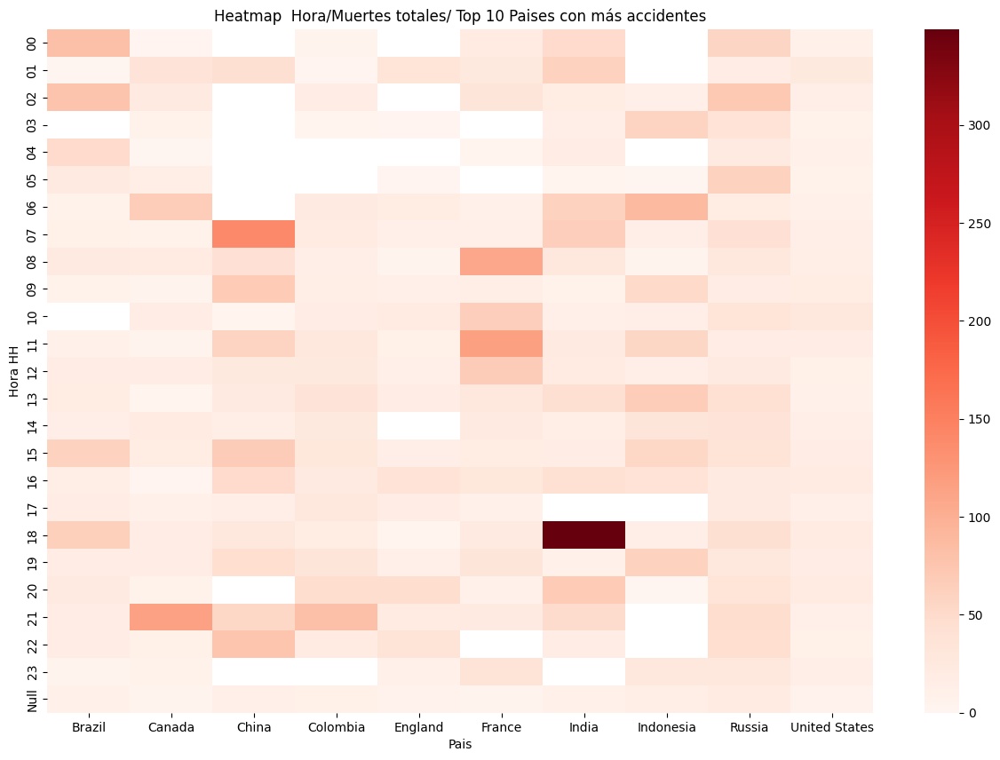

## Accidentes aéreos

 Hola!

 Este proyecto tiene como objetivo responder cuales son los principales factores que se encuentran involucrados en los incidentes aéreos desde 1908(17/sept.) hasta 2021(06/jul.).
 En el presente documento se ejecutaron diferentes tecnologías y herramientas para llegar a su fin, tales como :
 - Python (Matplotlib, Seaborn, Pandas y Numpy)
 - Power BI (DAX)
 - GitHub

 # Descripción del proyecto:

## Análisis exploratorio de los datos (EDA):

 Se tomó una base de datos de acceso público de la Organización de Aviación Civil Internacional (OACI) la cual cuenta con registros de más de 100 años de incidentes aéreos alrededor del mundo.
 Inicialmente se procede a realizar una primera aproximación al set de datos, en donde se encuentra que existen muchos valores desconocidos (?) pero que de alguna manera pueden llegar a representar una utilidad debido a que otorgan información parcial sobre algún aspecto de interés del estudio.

## Proceso de ETL
 Se realizan transformaciones a ciertas columnas con el objetivo de que faciliten el análisis posteriormente realizado en Power BI. Por tanto se escogen únicamente columnas como fecha, hora, ruta, operador, tipo de vuelo, tipo de aeronave, total de personas a bordo, pasajeros, tripulación, muertes totales, muertes de pasajeros, muertes de tripulación y bajas en tierra.

 - El siguiente paso realizado dentro del análisis es realizar modificaciones a columnas como Hora, con el fin de tomar únicamente valores que tuvieron lugar entre HH:01 y HH:59 para reducir el tamaño de las categorías a estudiar, obteniendo solamente 25 categorías, explicadas en el archivo 'ETL accidentes aereos.ipynb'. 

 - La columna fecha requiere de una normalización, dado que los datos no presentan una estructura homogénea para poder trabajarla en formato dd/mm/aaaa en Power BI, por tal motivo se ejecutan dichos cambios.

- La columna tipo de aeronave presenta 2469 valores únicos, por tanto se identifican los valores con mayores repeticiones con el fin de tenerlos en cuenta para un análisis posterior.

- Para tipo de vuelo, se toma en cuenta la estrategia del item anterior, dado que existen 3839 valores sin repetir, a pesar de esto es importante resaltar que el valor con mayores repeticiones en el dataset es un valor desconocido con 762 repeticiones, seguido de vuelos de entrenamiento y vuelos de avistamiento. Por otro lado, esta columna no presenta una alta calidad en los datos, dado que también se presentan rutas (i.e. Rio de Janeiro - Sao Paulo) restando valor a la información depositada en esta columna.

- Los operadores de los vuelos son un total 2268 distintos y se tuvieron en cuenta los más representativos para el posterior análisis.

- Para obtener la ubicación de los incidentes, se recurre a la columna Ruta y se realiza una extracción de la información pertinente, dado que esta columna ruta presentaba información como ciudad y en algunos casos, región, las cuales eran irrelevantes para el análisis que se realizaría posteriormente. Por tanto se extrae únicamente la información del páis donde ocurrió el accidente. Sin embargo esta columna es la que mayor limpieza requierió, debido a que se presentan typos que dificultan ejecutar reglas generales de limpieza de datos y se deben tratar 1 a 1.

- Por último se generan algunas medidas estadísticas para poder identificar valores atípicos, no obstante esto es únicamente informativo debido a que en este análisis se priorizó la información publicada oficialmente sobre cualquier otro criterio, principalmente debido a que si bien se encuentran valores atípicos, es el registro oficial y considero este criterio superior.

## Análisis del ETL y EDA:

Distribución de accidentes por número de personas a bordo

Distribución de accidentes por número de muertes totales

Se evidencia que las muertes de los pasajeroes es mucho menos probable que las muertes de los tripulantes, dado que no todos los vuelos necesaiamente llevan pasajeros, pero virtualmente todos los vuelos deben llevar por lo menos 1 tripulante y este se trataría del piloto de la aeronave.
Si bien se pueden tratar de vuelos donde no hay pasajeros y esto correspondería a vuelos de cargamento, vuelos militares, vuelos de reconocimiento, pero no vuelos turísticos y/o comerciales donde se espera que exista la presencia de muchos más pasajeros.

Se ejecutó otro análisis exploratorio para poder determinar si existía correlación entre las variables hora, muertes totales y el top 10 de los países con más número de accidentes aéreos.

Según la evidencia, no existe correlación entre las horas de los accidentes y un mayor riesgo de accidentalidad, con excepción de algunos casos particulares como lo son el caso de China, donde existe mayor probabilidad de accidente a las 7:00, lo cuál contrasta con el inusual número bajo de accidentes justo antes de las 7:00, entre 02:00 y 7:00. Este hecho podría explicarse porque en China no hay vuelos en esa franja horaria y el primer vuelo puede recoger el efecto de esa falta de actividad.
Otro punto relevante se encuentra en India a las 18:00, lo cualpuede ser explicado por un evento poco frecuente que multiplica las muertes, se trató de un accidente que involucró el choque de dos aeronaves de uso comercial, dejando un saldo de muertes muy por encima del promedio.

A pesar de lo anteriormente descrito, se evidencia que no existe relación fuerte entre el número de accidentes y el número de muertes, por tanto esto apoya la teoría de que la mayoría de los accidentes involucran aviones militares, de carga, vuelos de reconocimiento de zonas, vuelos de práctica y/o entrenamiento.

## Visualizaciones:
Al ejecutar un análisis mas exhaustivo del set de datos en Power BI, se puede evidenciar que:

ver archivo 'Accidentes Aéreos.pbix'

     En el Dashboard se pueden utilizar de manera interactiva los filtros de los operadores de los vuelos y los filtros del tipo de vuelo, así mismo el slider del rango de tiempo se puede ajustar según lo indicado por el usuario para obtener visualizaciones sobre el mapa, la gráfica de linea y los KPIs presentados.
    
## Análisis & Conclusiones:
- A medida que avanza el tiempo se podría esperar mayor avance tecnológico que en teoría reduciría los riesgos de incidentes aereos, sin embargo así mismo los vuelos se hacen más populares y más accequibles para la población, lo cual implica que existan más vuelos circulando y esto a su vez aumenta la probabilidad de accidentes (no por razón porcentual sino por magnitud total).
- El país con mayor número de accidentes es EEUU con 1052 durante todo el rango de tiempo del análisis (17/09/1908-06/07/2021) y también es el país con mayor número de muertos totales por accidentes aéreos con 150.310 sobre su territorio.
- Los aviones de referencias Douglas xx son los que mayores accidentes tuvieron en la historia de la aviación hasta el momento, sin embargo esto podría deberse a que fueron referencias utilizadas por EEUU para sus incursiones en guerras como la segunda guerra mundial y la guerra de Vietnam, a pesar de no ser aeronaves de guerra, si se empleaban como artilleros de suministros de guerra y transporte de tropas.
